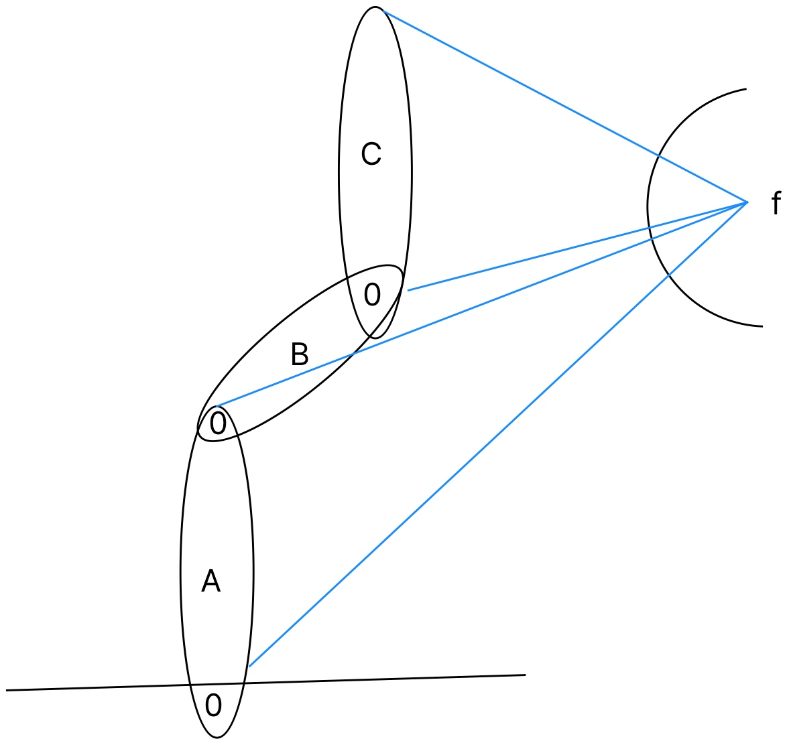
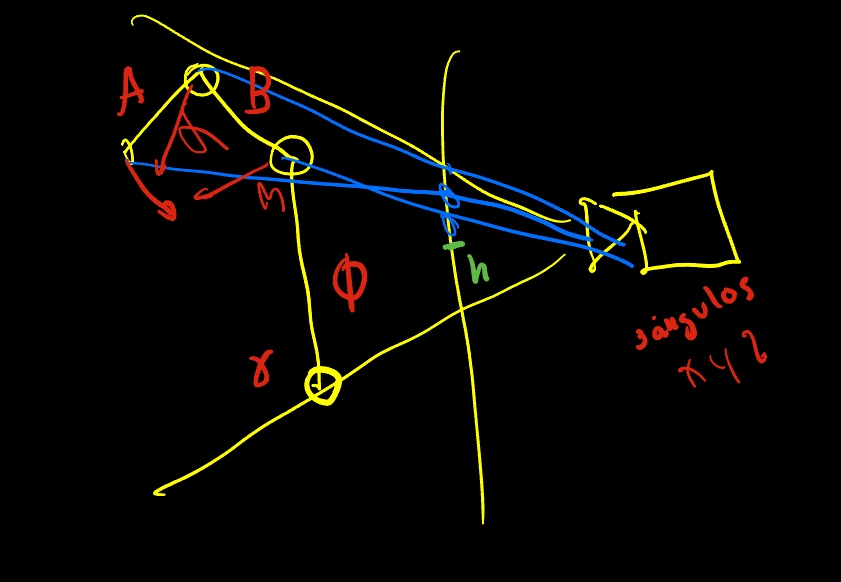
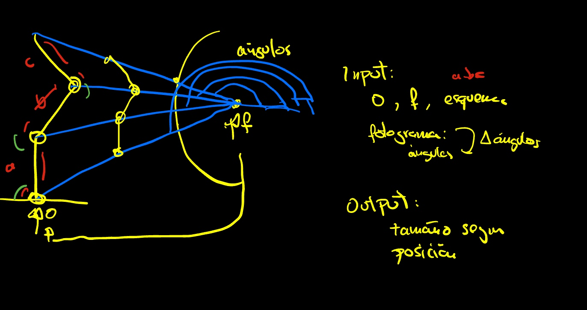
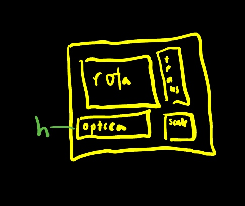
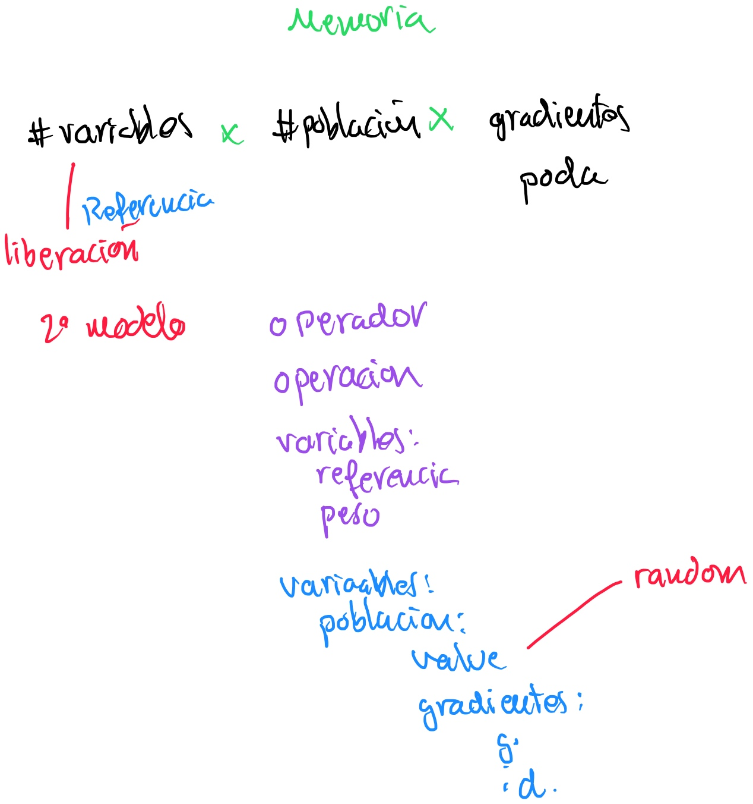
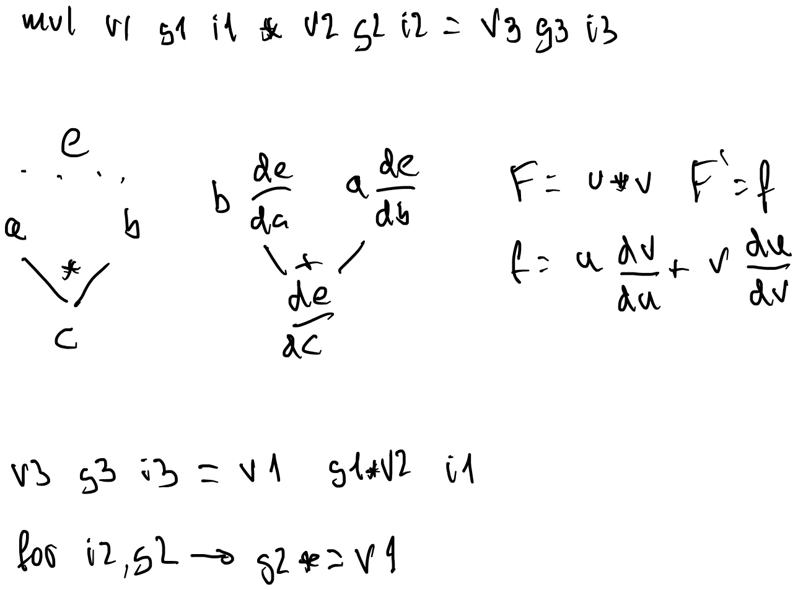
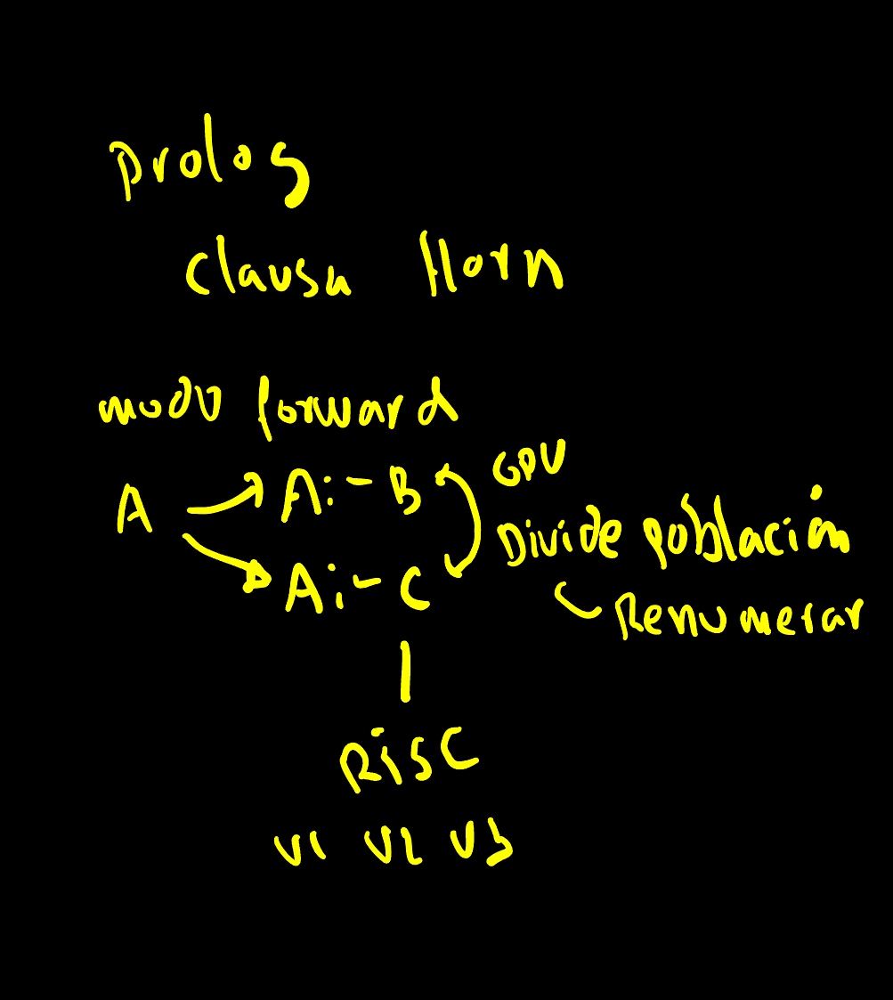

# Technique Using Genetic Algorithms and Neural Networks with Application to Robot Kinematics Inversion for Model Calibration 
* Alterntiva 1: Genetic Algorithms and Neural Networks with Application to Robot Kinematics Inversion for Model Calibration using cameras
* Alternativa 2 : Robot Kinematics calibration using Computational Differentiation and Genetic Algorithms

# [Acta](acta.md)

# Contenido
[Video describiendo los componentes](https://www.youtube.com/watch?v=gUWkNzerZMI)

Fuera de video:

* autoforegpu.py es una migración a gpu.
* autoforegpu2.py es un intento sin éxito de acelerar agrupando las llamadas usando ejecución perezosa.
* autoforegpu3.py es un intento sin éxito de acelarar incluyendo la asignación. Sube el número de variables ya que las constantes ocupan registros.

En cualquier caso aunque sea un fallo, está pendiente de repetir los experimentos con un problema mas complejo de los dos autocontenidos en la familia de ficheros autofore. Los dos ejemplos son el del blog de colah (https://colah.github.io/posts/2015-08-Backprop/)

* autoforenumpy.py en ejemplo_simple() verifico que numpy puede realizar operaciones en paralelo. Confirmo que numpy usa optimizaciones a bajo nivel. En windows se usan todas las cpus y en mac usa optimizaciones para ARM.

Deriva de la versión de autoforegpu∂ ya que no se tiene que pedir memoria, cuestión que es muy lenta en python.

# Abstract
This paper presents a novel technique that combines genetic algorithms and neural networks??? (Computational differentiation??), specifically designed for model parameter calibration. The innovation lies in the simultaneous adjustment of parameters by both the neural network and the genetic selecction. This method is applied to a robotic kinematics inversion problem, where a physical model is used to adjust movement, and the proposed technique is employed to find the model's parameters.

A CUDA implementation is provided, making it an ideal solution for modeling complex systems. The technique leverages self-differentiation, affine transformation matrices, forward mode, and a hybrid approach that combines genetic algorithms with gradient descent to estimate the kinematic inverse of a robotic arm through camera adjustment in a simulated environment.

The population is utilized to test various initial parameter seeds, while the gradient descent is employed for weight optimization, akin to neural network training. A GPU implementation is provided, along with a library that facilitates defining diverse physical models. This technique aims to simplify the modeling and calibration of physical problems.

**Keywords:** Genetic Algorithms, Neural Networks, Kinematics Inversion, Model Calibration, Robot Arm Simulation

# Estado del Arte
La neuroevolución combina redes
neuronales con algoritmos genéticos.
Aunque habitualmente el algoritmo genético se utiliza para optimizar la arquitectura de la red neuronal, capas, número de neuronas.
https://ekoizpen-zientifikoa.ehu.eus/documentos/5eccf5c129995207b7db4a96
Algunos trabajos, en conducción autónoma usan el algoritmo genético para cambiar directamente el peso de las neuronas, sin gradientes.
Hay trabajos en los que se usan programación genética diferencial. Estos modelos tratan de optimizar una función y sus parámetros. En nuestro trabajo el grafo de operaciones se supone dado por las descripción física del problema. Y la población genética contiene una población 
Por otro lado en las Physics-Informed Neural Networks (PINN) se incorporan leyes físicas descritas por ecuaciones diferenciales parciales (PDE) directamente entre las capas neuronales.
Son apropiados cuando los datos son escasos y apropiados en simulación de problemas mecánicos.
El aprendizaje profundo se caracteriza por emplear muchas variables o pesos.
La PINN suele ceñirse a un número de capas o bloque, no se ha trabajado la idea de una red PINN 100%, salvo en problemas de dinámica. Una de las características que podría hacer este enfoque es que el número de variables sea menor.
Habitualmente se utiliza el modo reverse o la backpropagation, para ajustar el peso de las variables. Sin embargo es bien conocido que cuando el número de variables es bajo,  método forward es más apropiado.
El algoritmo genético se ha visto siempre como una alternativa a los métodos de descenso de gradientes. Ya que no presenta los problemas clásicos de estancamiento en mínimos locales.
Es bien sabido que una función puede tener varios mínimos locales y que el descenso de gradiente puede depender de la semilla inicial para asegurar la convergencia.
En este trabajo se utiliza la población como semilla. De un proceso físico. 
Se realiza una simulación y se ajustan los parámetros de la simulación.
Se halla un modelo y se oculta, mago de oz, el sistema ha de tener la capacidad de ajustar los parámetros.
¿Por qué un problema simulado? El objetivo del paper es demostrar que la técnica funciona y converge. En un problema real sería muy difícil demostrar que la convergencia alcanzada es la ideal. Por lo que se ha optado por un par de ejemplos simulados.
En el primero, con fines ilustrativos, se emplea un autómata celular, con unos vehículos que se mueven por un ..
En el segundo se incorporan dos aportaciones, uno que el empleo de la Jacobiana y la calibración de … por primera vez. 

# Introducción
## Introducción al problema 
Dado un brazo robótico, del que se desconocen las dimensiones y posición inicial de los segmentos A, B, C. Se tiene una cámara ideal con un punto de foco f y se conocen las proyecciones de todos los segmentos. El problema se trata de realizar rotaciones en los segmentos y a través de la perspectiva deducir la dimensión de los segmentos así como su posición. 
Por fines ilustrativo se presenta el problema en 2D, siendo similar su resolución en 3D.











Las matrices de rotación, translación y perspectiva.

## Introducción a la herramienta de deducción




¿Cuántas variables tener? Podemos fijar la memoria que se quiere consumir y sobre ella determinar la población en función de las capacidades de concurrencia, por ejemplo número de nucleos cuda o DS. El número de gradientes a usar se fijaría según la precisión del problema haciendo varios experimentos. En el caso de escribir en una referencia el programa dejará de funcionar. No sabremos nunca cuando una determinada variable se deja de referenciar, pero una filosofía de caché que reusara las que no se han usado hace mucho tiempo puede servir.
Idealmente para que la caché funcione es conveniente que la población esté detrás de la variable.
El color morado es que está en CPU y en azul es que está en GPU.
Los randoms se usan los proporcionado por numpy y se cargan mediante copia a GPU.
La gpu es tonta no tiene control de si se ha usado una variable o no.
Se le pasa el operador y los operandos, origenes y destino.
Las de peso no se pierden. 
Se puede usar en cpu una cuenta de referencias o una utilización circular.
En la referencia se guarda el número de operación y se borraría lo que se referenció en la última operación. El uso circular se quitaría este chequeo.
Se utiliza una filosofía RIS, todas las operaciones son con registros. Luego si tenemos que multiplicar por una constante esta sería cargada en un registro.


```python

	def add(self):
		idx=cuda.grid(1)
		if idx>=self.value.shape[1]:
			return
		self.value[self.dest, idx] = self.value[self.src1, idx] + self.value[self.src2, idx]
		for i in range(self.g.shape[2]):
			self.g[self.dest, idx, i] = self.g[self.src1, idx, i] #
			self.id[self.dest, idx, i] = self.id[self.src1, idx, i]
			if self.id[self.src2, idx, i]!=-1:
				break
		for k in range(self.g.shape[2]):
			id2=self.id[self.src2, idx, k]
			if id2==-1:
				break
			i=self.id[self.dest, idx, 0]
			min=self.g[self.dest, idx, 0] 
			g2=self.g[self.src2,idx,k] #
           
			for j in range(1,self.g.shape[2]):
				idd=self.id[self.dest, idx, j]
				if id2==idd:
					i=-1
					self.g[self.dest, idx, i] +=  g2
					break
				gd=self.g[self.dest, idx, i] #
				if np.abs(min)>np.abs(gd):
					min=gd
					i=idd
			if i!=-1 and self.g[self.dest, idx, i] > g2:
				self.g[self.dest, idx, i] = g2
				self.id[self.dest, idx, i] = id2


```

src1 y src2 son variables de entrada, dest es el resultado. El algoritmo comienza asignando todos los gradientes de src1 a dest. Se trata de quedarse con los mayores gradientes mas significativos. La suma es una adición de gradientes. Hay que asegurarse que el gradiente no está, en la misma pasada podemos detectar también el mínimo. Si no se encuentra y el nuevo gradiente es suficientemente significativo se asigna. Ser suficientemente significativo significa ser mayor en términos absolutos.




Se detallan solo los cambios que se realizarían en el algoritmo anterior. El algoritmo es prácticamente el mismo salvo que los gradientes son multiplicados con el valor de la otra rama.

# Extensión Algorítmica
Los modelos Hamiltonian Monte Carlos (HMC) son una forma de explorar en una serie temporal el espacio de exploración de una forma no aleatoria (MCMC).
Para ello se modelan las variables del sistema como variables aleatorias que siguen una determinada distribución estadística. 

Es decir, se estudia como:

-> X -> Y

Si incluimos la función o programa F. En vez de presuponer una variable aleatoria podemos suponer un programa aleatorio.

-> F -> Y

¿Qué es un programa aleatorio?



Lo mismo que una variable aleatoria, con ruido, puede generar una salida con su PDF el objetivo en la extensión algorítmica es generar un espacio de funciones que generan salidas con PDFs.


Para ello introducimos varias ideas.

1. Lenguaje de primer orden.
2. GPU metainterprete.
3. ADN.
4. Autodiferenciación.

Este modelo es una extensión del otro, ya que lo puede contener variables, pero las analizaremos a posteriori, para centrarnos inicialmente en F que es quizá la característica más relevante.

Vamos a comenzar definiendo un lenguaje preposicional muy restringido como espacio de funciones F.

F:-A.
F:-B.

Suponga que son cláusulas de horm.

Suponga que F se ejecuta en un entorno altamente paralelizable, una GPU con 20000 núcleos cuda.
En cada núcleo cuda se ejecuta una versión del programa.
Al ejecutar F, como hay dos alternativas de programa, A y B supongamos que la mitad de los núcleos instnacian A (10k) y la otra mitad B(10k).

Se puede implementar en cuda un metaintérprete. Cada población/núcleo tiene su propio ADN.
La instancia de cuda, al llegar a F, mira su ADN, descubre que no está definida esa opción y se instancia, cada instancia tiene un número, si hay dos instancias, para producir un reparto uniforme basta emplear i%2, siendo i su número de instancia cuda y 2 el número de opciones (A,B) que existen. 
Obviamente tenemos otro elemento que codifica el programa de prolog en memoria de GPU.

En el caso de encontrarse una variable se procede de manera análoga.

F:-float(0,1) x

Se procede de manera análoga, se instancia la variable con un valor comprendido entre 0 y 1 y continua la ejecución.

## ¿Donde se ejecutan las cosas?
Tradicionalmente la CPU dirige a la GPU.
La idea es que A contenga micro instrucciones, de tipo RISC haciendo las operaciones op v1, v2, v3 que describimos previamente. 
Estas instrucciones están pensadas para ejecutarse en CPU y mediante autodiferenciación se repliquen para toda la población.

En nuestro modelo vamos a hacer que la GPU mande a la CPU que ejecute A. Para ello imaginemos una lista de A, en el que hay un índice a ADNs. Cuando una instancia desea ejecutarse se introduce en la lista. 
La CPU cuando tiene suficientes instancias lanza una ejecución en paralelo de las mismas. 
La CPU lanza las microinstrucciones.

# La paradoja prolog/modo forward.
Si bien es conocido que la backpropagation es mas eficiente cuando hay muchos parámetros y pocas salidas. Y el método forward es más eficiente a la inversa, cuando hay pocas variables y muchas salidas.

Si hacemos una ejecución bajo demanda, para solucionar F, busca A o B. Estamos escribiendo la función de abajo a arriba, estamos ejecutnado las cosas al inverso de como se ejecutan los programas.

Podemos tener la ventaja de los dos mundos, el de explorar distintos mundos, como hace prolog, y el de la backpropagation, podemos derivar desde la salida a los parámetros. 

En conclusión, 
1. podemos operar en modo forward y tener las ventajas de backpropagation.
2. podemos combinar imperativo y lógico.
3. podemos paralelizar las poblaciones por alternativas o variables.

Una vez completada las ejecuciones a traves de los gradientes podemos hacer ajustes.
En las alternativas se introducen pseudo gradientes, que facilitan dicha operación.

# ¿Qué es un pseudogradiente?
Es un falso gradiente que se añade, cuando es A se pone a 1 en A, cuando es B se pone a 1 en B.
Este gradiente se hereda, por dinamic prunning, solo los mas significativos son arrastrados.
Al final se tiene la correción de las variables y su influencia, qué algoritmos han intervenidos.

Usualmente agrupando varias ejecuciones podemos hacer un batch que corrija. Sumamos sus gradientes (obvio L, la función de pérdida).

Pero también podemos: si una variable X es compartida entre A y B podemos entre otras cosas hacer un batch de corrección condicional. Si A=1 la corrección es delta X.

En estos casos podemos:

1. Dividir X, de tal forma que evolucionene independientemente en un Xa o Xb.
2. En consecuencia, deducir de quien depende la corrección de X, si es del gen (A/B) o de otro. 
3. Realizar un aprendizaje, tejido conectivo/ingeligente entre una alternativa y una variable.
4. Inferir que B genera mayores correcciones, por lo tanto predice peor y producir menos bifurcaciones en B.

Respectivamente mitosis de variable, dependencia de variable, lógica y desarrollo explicativo (vs EMC clásico).

# Apilamiento
Lo mismo que existe la recursividad, en esta arquitectura se puede dar la recursividad estructural.
Es decir, se puede aprender como aprender, con la ventaja de no tener que desarrollar nueva programación. 
Obviamente no se puede responder una pregunta haciendo dos preguntas. 
Pero en mi investigación descubrí que podemos responder a dos preguntas al mismo tiempo, con una misma investigación.
Esta idea es similar a lo que realiza el aprendizaje profundo en las primeras etapas, un parámetro será utilizado por varias unidades. 

# Implementación
[Doctor Numba](drnumba.md)

# Conclusiones
Como se ve el número de variables y pesos es muy reducido pero se consiguen logros que el aprendizaje profundo no conseguiría.

Y aunque haya un a gpu de por medio, es cierto que el deploy, poner la versión entrenada en producción, es más sencilla ya que requiere menos hardware. Es mas barato ejecutar un modelo parametrizado que la inferencia de una red neuronal.


# Bibliografía
Industrial Robotic: Programming, Simulation and Applications, disponible via Fama us, en el capítulo 14 página 280 incluye una descripción de la lente, 273 para conceptos previos.


