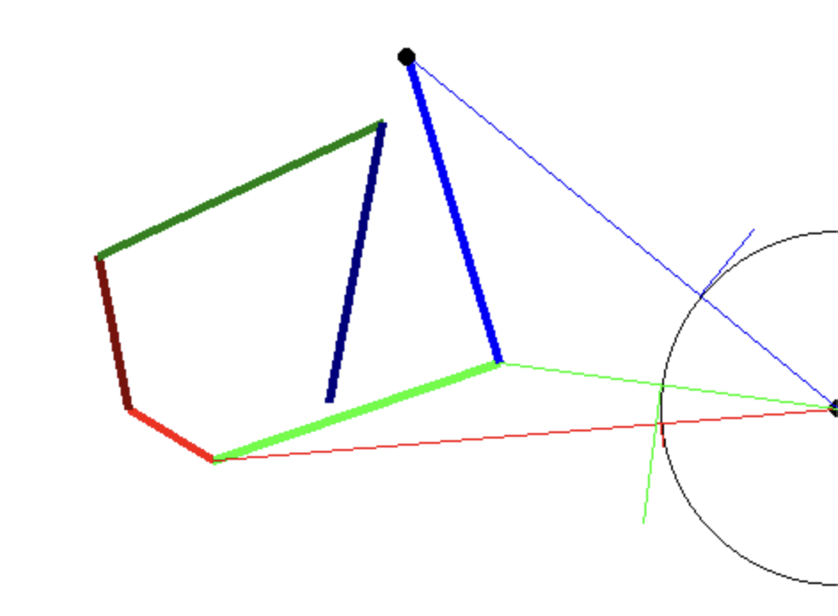

# roboticArm4

## Objetivos
* Deriva de [roboticArm3.py](roboticArm3.md)
* Se inicia la población de forma independiente
* Adaptación a una población que evoluciona independientemente
* Separación del interfaz gráfico del cálculo
* Impresión del mejor

# Novedades
* draw debería de dibujar una instancia identificada por id. 
* con un tono de color determinado.El mas claro para el brazo objetivo, el mas oscuro para el target.

* El error se computa al hallar los ángulos se compara con el de referencia y se acumula como delta.
```python
    error=angle-angle.value(0)
    error2=error*error
    error2.error2Delta()
    ...
nn.applyDelta(0.01)
```
No se cambian los tamaños.

segmentos como array
ojos como array
puntos continuos
población