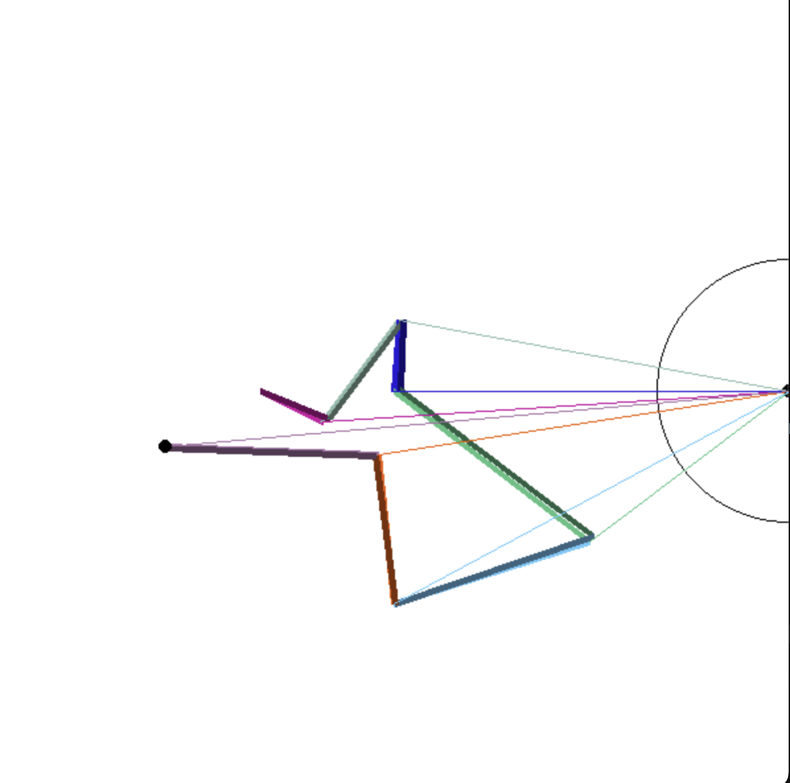

# RoboticArm5

* Visión estereoscópica

En este lugar se puede seleccionar un ojo o dos ojos.
```python
eyes=[Eye(screen,p.width,p.height//3),Eye(screen,p.width,p.height//3*2)]
eyes=[Eye(screen,p.width,p.height//2)]
```

Aunque se desarrolla inicialmente con visión estereoscópica al final funciona con un ojo simple pero haciendo dos cambios:

Cambiando la posición target del brazo cada ciertos fotogramas.
```python
changePositionEach=200
```

Y cambiando el descenso del gradiente.
En autoforenumpy:
```python
def applyDelta(self,epsilon):
    for peso,id in enumerate(self.peso2id):
        self.value[id]-=self.sign(self.delta[:,peso])*epsilon*np.abs(self.value[id])
        #self.value[id]-=self.delta[:,peso]	*epsilon
    self.delta[:,:]=0
```
En comentario está la versión clásica.
La tasa de aprendizaje o epsilon está en función del valor a corregir. De no ser así la amplitud tenía una corrección muy pequeña y la angular muy grande. Converge pero transcurre mucho tiempo.

tanh sería conveniente aplicarlo en la salida, pero por razones físicas no se puede aplicar la función de activación ya que necesitamos que sean ángulos para compararlas con el sistema visual. Digamos que de un ángulo dado por el sistema visual puedo averiguar el error... SI SE PUEDE. Lo abordo en roboticArm6.


* Se incluye la capacidad de dibujar poblaciones mayores: poblacion=5

* Se incluye la posibilidad de definir el número de segmentos: segments=4


Ejemplo de convergencia con 7 segmentos.