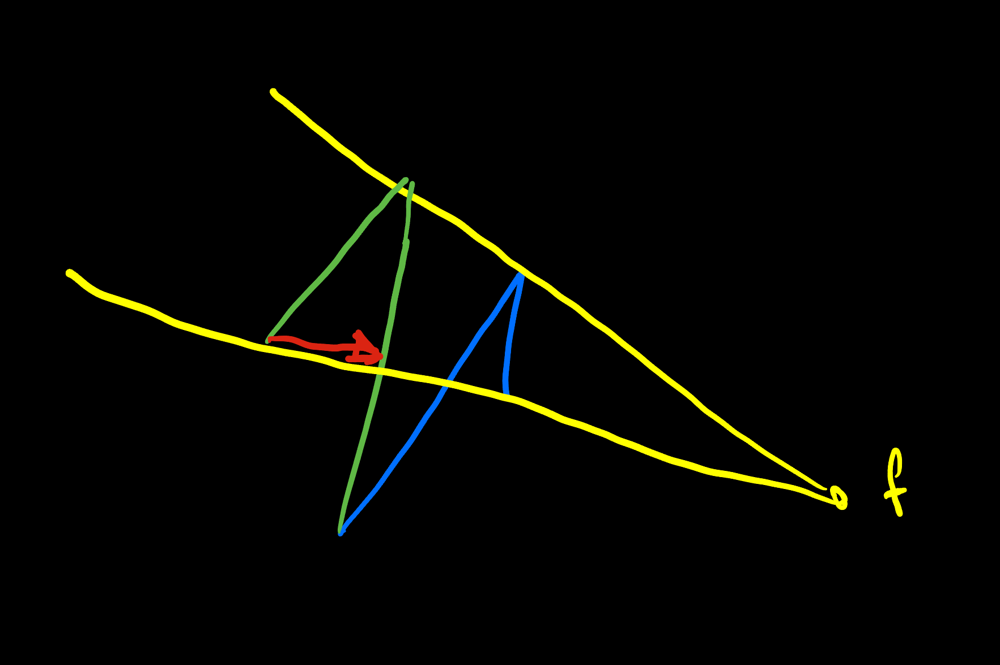
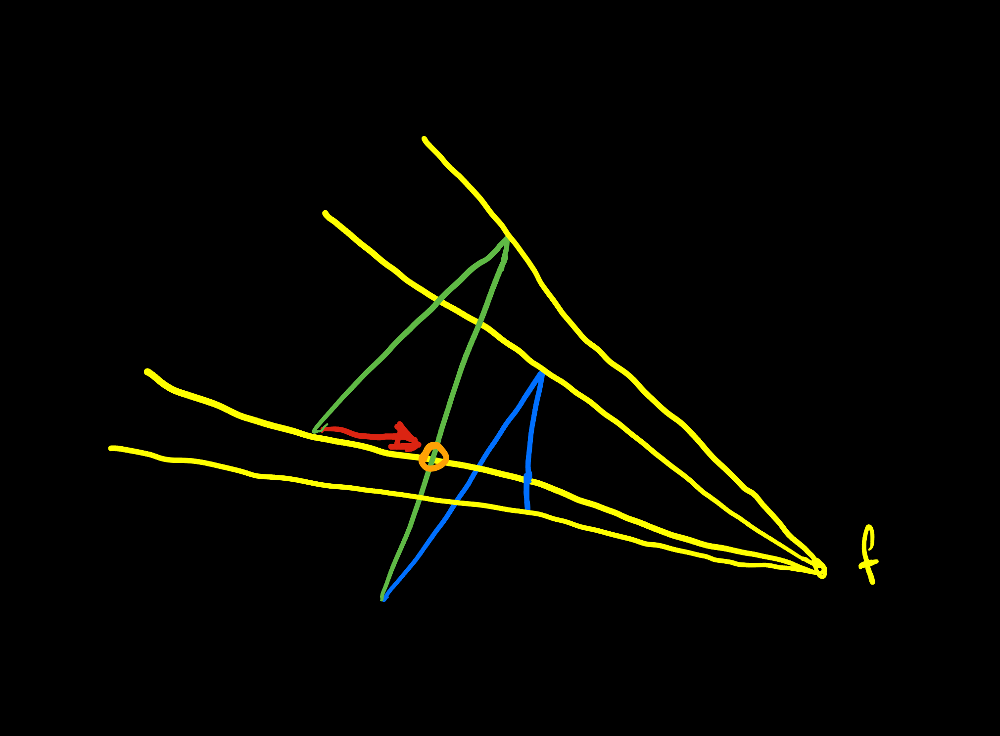
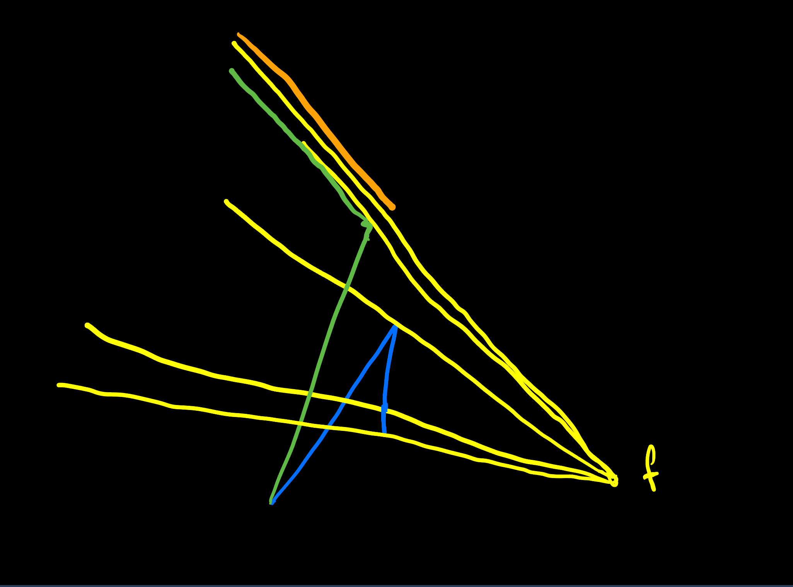

# Zorder
The concept of z-ordering is highly efficient and saves considerable time. It is straightforward to implement and demonstrates that the forward mode is superior to backpropagation when the operation graph changes for each frame. This is impractical for other methods due to the required "compilation" time.

From a mathematical perspective, the task involves finding the intersection point between two segments. This intersection point exerts a force in the direction of the line of sight.

## Python Code for Intersection of Two Segments Given Two Endpoints in a 2D Space

```python
import math

def intersect_segments_2d(P1, P2, Q1, Q2, tol=1e-9):
    """
    Find the intersection of two line segments in 2D.
    
    Parameters
    ----------
    P1, P2 : (float, float)
        Endpoints of the first segment.
    Q1, Q2 : (float, float)
        Endpoints of the second segment.
    tol : float
        Tolerance for floating-point comparisons.
    
    Returns
    -------
    None
        If there is no intersection.
    (x, y)
        If the segments intersect at exactly one point.
    ((x1, y1), (x2, y2))
        If the segments are collinear and overlap in a segment;
        returns the two extreme endpoints of that overlapping segment.
    """

    # Unpack points for convenience
    x1, y1 = P1
    x2, y2 = P2
    x3, y3 = Q1
    x4, y4 = Q2

    # Define some helper vectors
    u = (x2 - x1, y2 - y1)
    v = (x4 - x3, y4 - y3)
    w = (x1 - x3, y1 - y3)

    def cross_2d(a, b):
        return a[0]*b[1] - a[1]*b[0]
    
    def dot_2d(a, b):
        return a[0]*b[0] + a[1]*b[1]

    cross_uv = cross_2d(u, v)
    
    if abs(cross_uv) > tol:
        cross_v_w = cross_2d(v, w)
        cross_u_w = cross_2d(u, w)
        
        t = cross_v_w / cross_uv
        s = cross_u_w / cross_uv

        if -tol <= t <= 1 + tol and -tol <= s <= 1 + tol:
            ix = x1 + t*u[0]
            iy = y1 + t*u[1]
            return (ix, iy)
        return None

    if abs(cross_2d(u, w)) > tol:
        return None

    u_len_sq = dot_2d(u, u)
    v_len_sq = dot_2d(v, v)
    
    def point_on_segment_2d(pt, A, B):
        (Ax, Ay), (Bx, By) = A, B
        (Px, Py) = pt
        if (min(Ax, Bx) - tol <= Px <= max(Ax, Bx) + tol and
            min(Ay, By) - tol <= Py <= max(Ay, By) + tol):
            return True
        return False

    if u_len_sq < tol:
        if point_on_segment_2d(P1, Q1, Q2):
            return P1
        else:
            return None

    if v_len_sq < tol:
        if point_on_segment_2d(Q1, P1, P2):
            return Q1
        else:
            return None

    def param_on_P(pt, P1, u):
        px, py = pt
        p1x, p1y = P1
        return ((px - p1x)*u[0] + (py - p1y)*u[1]) / (dot_2d(u, u))

    alphaQ1 = param_on_P(Q1, P1, u)
    alphaQ2 = param_on_P(Q2, P1, u)

    alpha_min = min(alphaQ1, alphaQ2)
    alpha_max = max(alphaQ1, alphaQ2)

    overlap_start = max(0.0, alpha_min)
    overlap_end   = min(1.0, alpha_max)

    if overlap_start > overlap_end + tol:
        return None

    start_pt = (x1 + overlap_start*u[0], y1 + overlap_start*u[1])
    end_pt   = (x1 + overlap_end  *u[0], y1 + overlap_end  *u[1])

    dx = end_pt[0] - start_pt[0]
    dy = end_pt[1] - start_pt[1]
    if dx*dx + dy*dy < tol*tol:
        return start_pt

    return (start_pt, end_pt)

if __name__ == "__main__":
    s1_p1 = (0, 0)
    s1_p2 = (1, 1)
    s2_p1 = (1, 0)
    s2_p2 = (0, 1)
    res = intersect_segments_2d(s1_p1, s1_p2, s2_p1, s2_p2)
    print("Example 1:", res)

    s1_p1 = (0, 0)
    s1_p2 = (3, 3)
    s2_p1 = (2, 2)
    s2_p2 = (5, 5)
    res = intersect_segments_2d(s1_p1, s1_p2, s2_p1, s2_p2)
    print("Example 2:", res)

    s1_p1 = (0, 0)
    s1_p2 = (1, 0)
    s2_p1 = (0, 1)
    s2_p2 = (1, 1)
    res = intersect_segments_2d(s1_p1, s1_p2, s2_p1, s2_p2)
    print("Example 3:", res)
```

One of the challenges in parallel computation is handling instructions such as:

```python
if abs(cross_uv) > tol:
```

Since parallel processing is performed for all individuals in the population, executing a conditional instruction can be problematic.

These checks are necessary for cases where one of the endpoints lies on the segment. Can these cases be disregarded? The optimal approach to address this issue is to construct a graph.



- In blue, the prototypical robotic arm.
- In green, the model attempting to imitate the blue one.
- In yellow, the projections to the focus.
- In red, the force, as the intersection of the green and yellow lines.

The example is not appropriate because the projection lines do not have to be aligned.



The orange mark is the intersection point. As you can see, the yellow is a line, not a segment. You only need to be careful when two projection lines are aligned.

One of the cases is impossible, the inferior in our example because the second segment is not connected to the origin or base. 



They have been drawn slightly non-overlapping for clarity.
In this case, two of the projections are the same. That's easy to detect because we have the same angle in two consecutive segments.

Remember that we are applying the same algorithm to all models. If the difference is 0 between consecutive angles, we may have a value of 0 to multiply and cancel the correction.

At the beginning, we are satisfied with drawing only the red lines. Then we will apply the mathematics and finally the corrections. In reality, any segment can be hidden by any other segment.

We need to measure the distances of the projections, as well as the intersections of other segments. Identify which is the minimum. And see if the minimum differs between the model and reality (blue). If the minimum does not match, we must apply a force between the minimum of the model and the intersection. The force can be in both directions, as if it were a rubber band pushing attractively.

First, we program something iteratively and then we think about the data structure for the calculation.


jefe de proyecto.
Ineco.
Ineco en Sevilla.
danil@ineco.
Jorge 914521200
